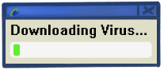
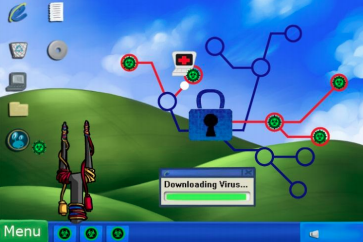

# Network Nightmares

ActionScript source code for an arcade 'learning' game exploring network security topics.

Code is provided for historical/educational purposes only - the last revision was made in 07/2012.

## About

Network Nightmares was a game created as part of a research project in 2012 and submitted to [fdg2013](http://fdg2013.org/). Mastermined by [William Ryan](http://www.williamryanonline.net/), the game was part of a larger curriculum exploring network security. All artwork by [Jackie Crofts](http://jackiecrofts.com). Programming and sound design by [Dean Verleger](https://github.com/deanbot). Level theme music by Max.

Research paper: http://fdg2013.org/program/festival/networknightmares.pdf

## Gameplay

Played from the POV of a hacker, the gameplay includes slingshotting projectiles or "viruses" at targets, aka "network nodes". Hitting a node with a virus "infects" it, and alerts ai entities, aka "network admins". Network admins follow paths to infected nodes and work to recover them. Infecting a "hub" node infects all connected nodes at once. The goal of each level is to infect all nodes on a network before the network admins can recover them. 

A secondary mechanic deals with the "lives" or available viruses the player has. The player starts with 3 viruses. When a node is infected with a virus the player slowly accumulates additional viruses at their dispoal. The more infected nodes, the more rappidly viruses are awarded. The player loses when they run out of viruses.

## Play It!

Play (with Flash Player) at [networknightmares.dreamfed.net](https://networknightmares.dreamfed.net).